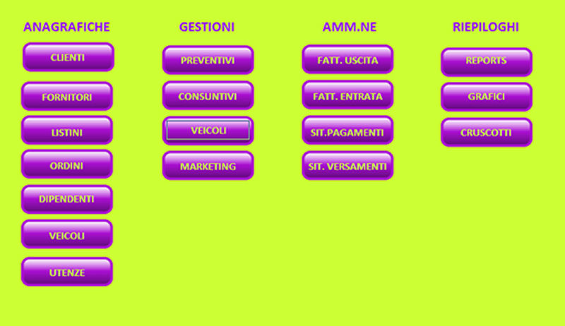

# ERP-per-le-PMI-in-PHP
Un ERP web-based in PHP per le Piccole e Medie Imprese (PMI) 
di Pasquale Alfano
13-09-2023

Il progetto si propone di realizzare una applicazione **ERP (Enterprise Resource Planning)** indirizzata alle Piccole e Medie Imprese.
A causa della variabilità di leggi e regolamenti nel mondo, l'applicazione è sviluppata per essere utilizzata solo in Italia ma
non è escluso che possa essere customizzata con le specificità di un dato Paese.
Purtroppo, non è sufficiente la sola localizzazione per poterla utilizzare negli USA o in India.

Il progetto unisce quindi l'esercizio collaborativo Open-Source con la creazione di una applicazione di libero utilizzo
per le PMI, che ancora oggi (2023) faticano a digitalizzarsi, vuoi per i costi da sostenere, vuoi per un approccio mentale
un po' restio all'innovazione ("...abbiamo sempre fatto così!").

Al momento, chi fosse interessato all'idea ed a partecipare, può prendere visione del file **Presentazione_ENTERPRISE_REV_0_0.pdf**
in questa stessa repo, che riassume le motivazioni pratiche (per le aziende) nel prendere in considerazione di dotarsi di una simile 
applicazione e fornisce un'idea di come sarà sviluppata l'applicazione.

L'applicazione verrà realizzata in PHP (e tecnologie accessorie che si dimostreranno utili allo scopo) e sarà fruibile tramite
interfaccia web.

Al momento, l'applicazione è pensata per girare "on-premises" e quindi presuppone che l'azienda che intenda servirsene, sia
almeno dotata di un dominio web o di una intranet.

Se si rileverà interesse, si può pensare ad una implementazione SaaS.
